# ApplyDay – Your Personal Job Application Dashboard

<div align="center">


[](https://github.com/pandalow/applyday)
[](#privacy-first)
[](#philosophy)

**Human-in-the-Loop • Data-Driven Growth • Open Source**

</div>

## 🎯 Why ApplyDay?

This project was born from my own job search. I built it to track applications, analyze trends, and identify gaps—and now it's actively supporting me in the process. I've always believed that **data can help you succeed**. 

In today's recruitment market, every applicant seems reduced to just another "data point." Companies have powerful dashboards, full business analytics, and market insights to find the right candidates. But what about us—the applicants, the so-called data carriers? 

**This software is my answer: your own personal dashboard system.**

Most resume assistants and job platforms focus on "how to package yourself"—with fancier wording, or even fabricated experiences, to fit a role. But that's only a short-term tactic. What truly determines long-term success is the real skills you possess and continuously improve.

## 🔄 Philosophy: Human-in-the-Loop Growth Cycle

This open-source project builds a three-step growth cycle: **Record → Analyze → Improve**.

```mermaid
graph LR
    A[📝 Record] --> B[🔍 Analyze] 
    B --> C[🚀 Improve]
    C --> A
    
    A1[Applications<br/>Interviews<br/>Rejections<br/>Requirements] -.-> A
    B1[Patterns<br/>Progress<br/>Gaps<br/>Trends] -.-> B  
    C1[Learning Tasks<br/>Growth Paths<br/>Skill Development] -.-> C
```



### What ApplyDay **CAN** help you do:
- ✅ Record applications, interviews, rejections, offers with conversion funnel
- ✅ Lightweight NLP data statistics and trend analysis  
- ✅ Provide analysis scenarios based on quantitative mining
- ✅ Reference suggestions for your choice of LLM
- ✅ Generate personalized growth paths

### What ApplyDay **WON'T** do for you:
- ❌ Auto-submit resumes or fake cover letters
- ❌ Pretend to be you when communicating with HR
- ❌ Fabricate experiences to cater to positions
- ❌ Upload data to cloud (completely local)
- ❌ Replace your thinking and decision-making

## ✨ Features

### 📊 Personal Dashboard
- **Application Tracking**: Monitor your job application pipeline
- **Conversion Funnel**: Track progression from application to offer
- **Data Visualization**: Interactive charts and insights

### 🔍 AI-Powered Analysis  
- **Skills Analysis**: Identify in-demand skills and personal gaps
- **Market Trends**: Understand job market patterns
- **Personalized Insights**: AI-generated recommendations for growth
- **Network Visualization**: See skill relationships and clusters

### 📈 Growth Tools
- **Resume Integration**: Upload and analyze your resume against market demands
- **Learning Roadmaps**: Get specific action plans for skill development
- **Progress Tracking**: Monitor your improvement over time

## 🔒 Privacy First

- **100% Local**: Runs entirely on your machine
- **No Cloud Upload**: Your data never leaves your computer
- **Open Source**: Full transparency in how your data is processed
- **Self-Hosted**: You control everything

## 🚀 Quick Start

### Prerequisites

- **Docker & Docker Compose** (Recommended)
- **OR** Node.js 20+, Python 3.12+, and PostgreSQL (for development)

### 🐳 Production Deployment (Docker)

```bash
# Clone the repository
git clone https://github.com/pandalow/applyday.git
cd applyday

# Set up environment variables
cp .env.example .env
# Edit .env with your AI provider and API key (see Environment Configuration section below)

# Start with Docker Compose
docker compose up -d

# Access the application
open http://localhost
```

That's it! ApplyDay will be running at `http://localhost` with:
- Frontend: React app with data visualization
- Backend: Django API with AI analysis
- Database: SQLite (automatically created)

### 🛠️ Development Setup

#### Backend (Django + AI Services)

```bash
cd backend/applyday

# Create virtual environment
python -m venv venv
source venv/bin/activate  # On Windows: venv\Scripts\activate

# Install dependencies
pip install -r requirements.txt

# Set up database
python manage.py migrate

# Run development server
python manage.py runserver
```

#### Frontend (React + Vite)

```bash
cd frontend/applyday

# Install dependencies
npm install

# Start development server
npm run dev
```

Visit `http://localhost:5173` for development.

## 📋 Environment Configuration

Create a `.env` file in the root directory:

```env
# AI Configuration - Choose your provider
AI_PROVIDER=openai              # Options: openai, anthropic, google
AI_MODEL=gpt-4o                 # Model name (varies by provider)
AI_TEMPERATURE=0                # Response randomness (0.0-1.0)

# OpenAI Configuration (if AI_PROVIDER=openai)
OPENAI_API_KEY=your_openai_api_key_here

# Anthropic Configuration (if AI_PROVIDER=anthropic)
ANTHROPIC_API_KEY=your_anthropic_api_key_here

# Google AI Configuration (if AI_PROVIDER=google)
GOOGLE_API_KEY=your_google_ai_api_key_here

# Django Settings
DJANGO_SECRET_KEY=your_secret_key_here
DJANGO_DEBUG=False
DJANGO_ALLOWED_HOSTS=*
CORS_ALLOW_ALL_ORIGINS=True
```

### 🤖 AI Provider Options

ApplyDay supports multiple AI providers for analysis and insights:

#### OpenAI (Default)
```env
AI_PROVIDER=openai
AI_MODEL=gpt-4o                 # Options: gpt-4o, gpt-4o-mini, gpt-3.5-turbo
OPENAI_API_KEY=your_key_here
```

#### Anthropic Claude
```env
AI_PROVIDER=anthropic
AI_MODEL=claude-3-haiku         # Options: claude-3-haiku, claude-3-sonnet, claude-3-opus
ANTHROPIC_API_KEY=your_key_here
```

#### Google Gemini
```env
AI_PROVIDER=google
AI_MODEL=gemini-pro             # Options: gemini-pro, gemini-pro-vision
GOOGLE_API_KEY=your_key_here
```

**Note**: You only need to set the API key for your chosen provider.

## 🏗️ Architecture

```
ApplyDay/
├── frontend/           # React + Vite frontend
│   ├── src/
│   │   ├── components/ # Reusable UI components
│   │   ├── pages/      # Main application pages
│   │   ├── charts/     # Data visualization components
│   │   └── service/    # API integration
│   └── Dockerfile
├── backend/            # Django backend
│   ├── applyday/       # Main Django project
│   ├── application/    # Application tracking models
│   ├── report/         # Analysis and reporting
│   ├── ai/             # AI integration services
│   └── Dockerfile
├── data/               # Sample data and uploads
└── docker-compose.yml  # Full-stack deployment
```

## 🔧 Tech Stack

### Frontend
- **React 19** - Modern UI framework
- **Vite** - Fast build tool and dev server
- **TailwindCSS** - Utility-first styling
- **ECharts** - Interactive data visualization
- **Framer Motion** - Smooth animations

### Backend  
- **Django 5.2** - Robust web framework
- **Django REST Framework** - API development
- **spaCy** - Natural language processing
- **LangChain** - AI integration framework
- **SQLite** - Lightweight database

### AI & Analytics
- **OpenAI GPT-4** - Advanced language model
- **scikit-learn** - Machine learning algorithms
- **pandas** - Data manipulation and analysis
- **numpy** - Numerical computing

### DevOps
- **Docker** - Containerization
- **Nginx** - Web server and reverse proxy
- **Gunicorn** - Python WSGI server

## 📖 User Guide

### 1. Recording Applications

1. Navigate to **Applications** page
2. Click **"Add Application"** 
3. Fill in job details:
   - Company name
   - Job title  
   - Job description
   - Application status
   - Stage notes

### 2. Uploading Resume

1. Go to **Resume Management**
2. Upload your PDF/DOC resume
3. The system will analyze your skills automatically

### 3. Generating Reports

1. Select applications you want to analyze
2. Choose analysis options:
   - Selected applications
   - Date range
   - All data
3. Click **"Generate Report"**
4. Review AI-powered insights and recommendations

### 4. Understanding Insights

Reports include:
- **Must-Have Skills**: Market-demanded core competencies
- **Differentiating Skills**: Specialized skills for your roles
- **Skill Synergies**: Related skills to learn together
- **Swiss-Knife Analysis**: Identification of overloaded job descriptions
- **Personalized Action Plan**: 3-step improvement roadmap

## 🤝 Contributing

We welcome contributions from the community! Here's how to get involved:

### Ways to Contribute

- 🐛 **Bug Reports**: Found an issue? [Open an issue](https://github.com/pandalow/applyday/issues)
- 💡 **Feature Requests**: Have an idea? [Start a discussion](https://github.com/pandalow/applyday/discussions)
- 🔧 **Code Contributions**: Submit pull requests for improvements
- 📖 **Documentation**: Help improve our docs and guides
- 🏷️ **Skill Tags**: Add new industry skills and job categories
- 🌍 **Translations**: Help make ApplyDay multilingual

### Development Workflow

1. **Fork** the repository
2. **Create** a feature branch: `git checkout -b feature/amazing-feature`
3. **Commit** your changes: `git commit -m 'Add amazing feature'`
4. **Push** to the branch: `git push origin feature/amazing-feature`
5. **Open** a Pull Request

### Code Style

- **Frontend**: Follow ESLint and Prettier configurations
- **Backend**: Follow PEP 8 Python style guide
- **Commits**: Use conventional commit messages

## 🗺️ Roadmap

### Version 1.0 (Current)
- ✅ Application tracking and management
- ✅ Basic AI analysis and insights
- ✅ Resume upload and parsing
- ✅ Docker deployment
- ✅ Data visualization with charts

### Version 1.1 (Planned)
- 🔄 Enhanced skill taxonomy and job categories
- 🔄 Multiple LLM provider support (Anthropic, Cohere, Local models)
- 🔄 Advanced analytics and trend prediction
- 🔄 Export functionality (PDF reports, CSV data)
- 🔄 Mobile-responsive improvements

### Version 2.0 (Future)
- 📋 Interview preparation tools
- 📋 Salary analysis and negotiation insights
- 📋 Job board integration
- 📋 Community features and skill sharing
- 📋 Advanced visualization dashboards

## 🆘 Support & FAQ

### Common Issues

**Q: The frontend shows empty data**
A: Check that both frontend and backend containers are running. Visit `http://localhost/test.html` to verify API connectivity.

**Q: AI analysis fails**
A: Ensure your OpenAI API key is correctly set in the `.env` file and you have sufficient credits.

**Q: Docker build fails**
A: Make sure you have enough disk space and Docker is properly installed. Try `docker system prune` to clean up space.

### Getting Help

- 📚 **Documentation**: Check our [Wiki](https://github.com/pandalow/applyday/wiki)
- 💬 **Discussions**: Join [GitHub Discussions](https://github.com/pandalow/applyday/discussions)
- 🐛 **Issues**: Report bugs in [Issues](https://github.com/pandalow/applyday/issues)
- 📧 **Contact**: Reach out to maintainers for urgent matters

## 📄 License

This project is licensed under the **MIT License** - see the [LICENSE](LICENSE) file for details.

## 🙏 Acknowledgments

- **Open Source Community** for amazing tools and libraries
- **Job Seekers Everywhere** who inspired this project
- **Contributors** who help make ApplyDay better
- **You** for being part of this journey

---

<div align="center">

**Made with ❤️ for job seekers, by job seekers**

[⭐ Star this project](https://github.com/pandalow/applyday) • [🍴 Fork it](https://github.com/pandalow/applyday/fork) • [📢 Share it](https://twitter.com/intent/tweet?text=Check%20out%20ApplyDay%20-%20Your%20Personal%20Job%20Application%20Dashboard!&url=https://github.com/pandalow/applyday)

</div>


