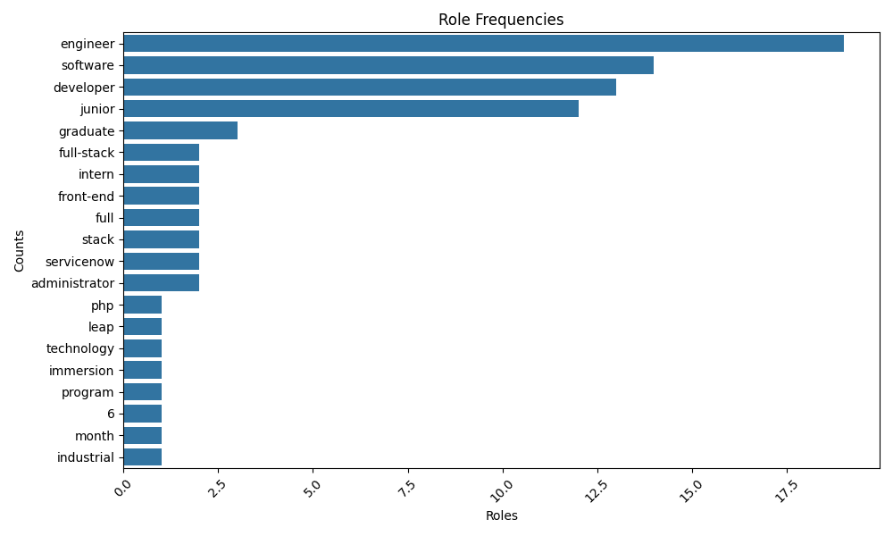
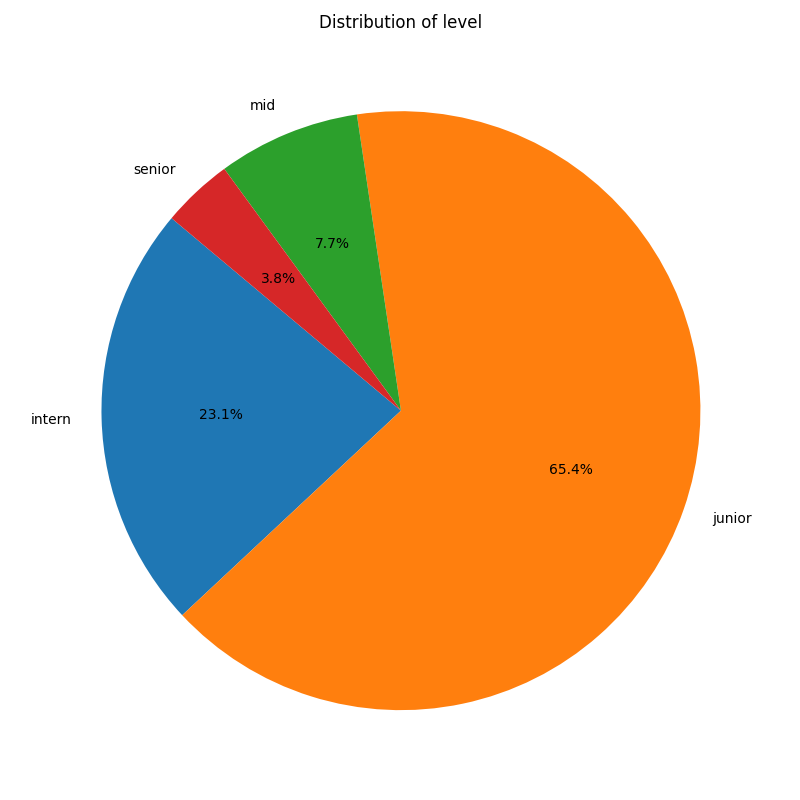
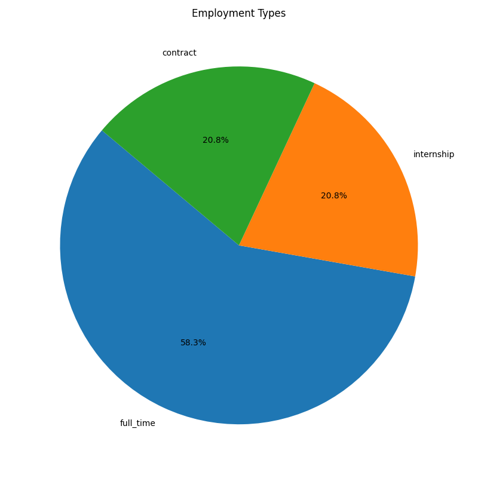
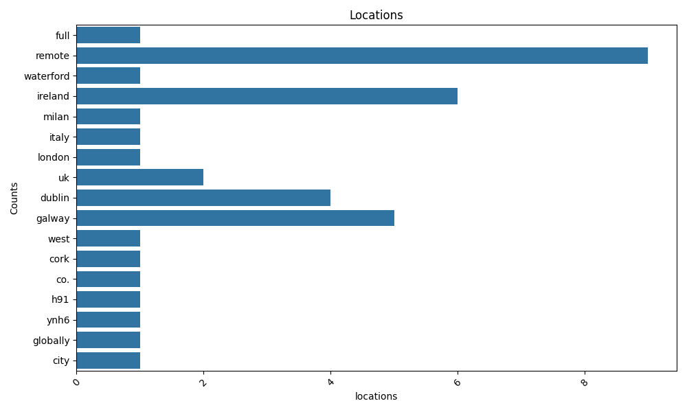
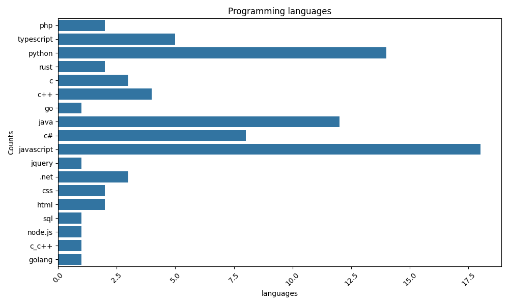
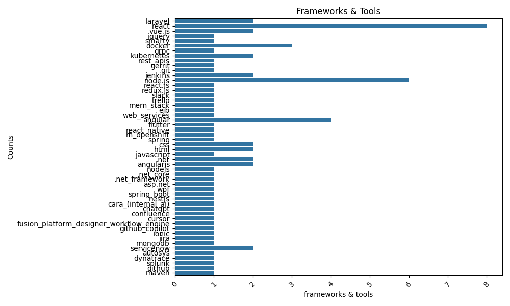
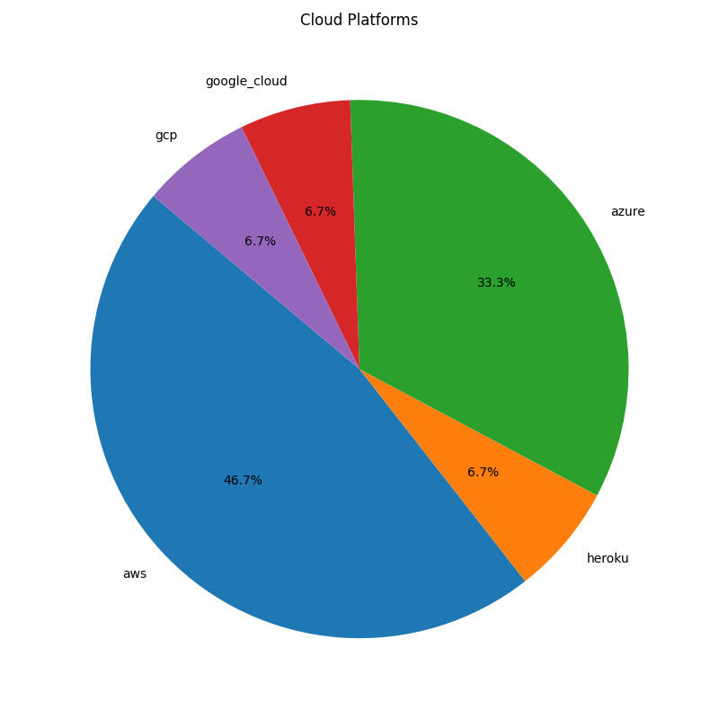
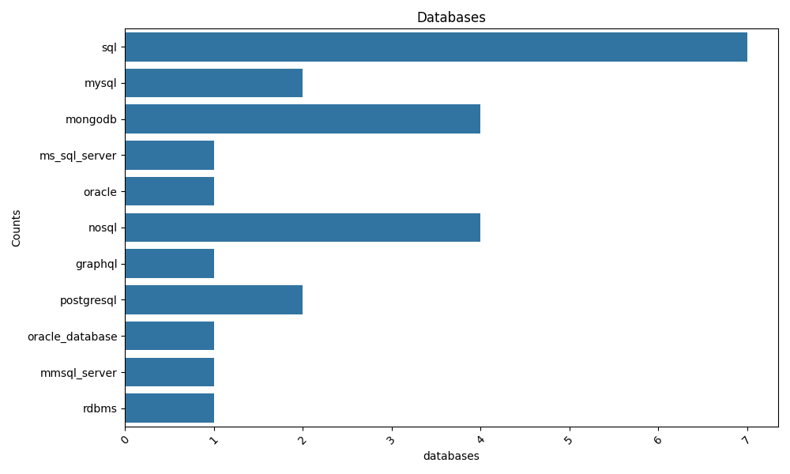
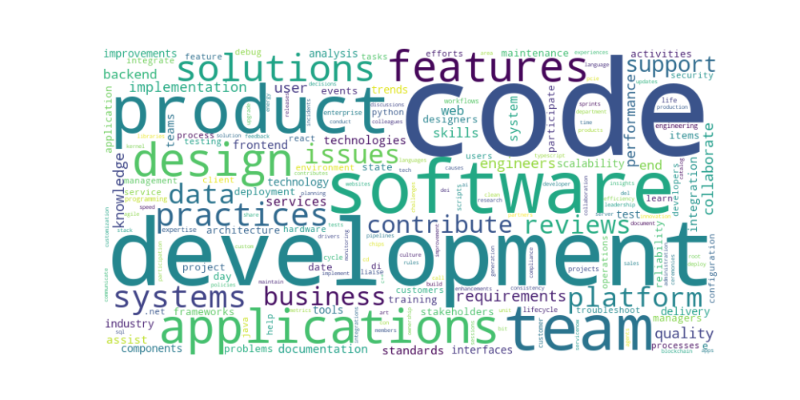
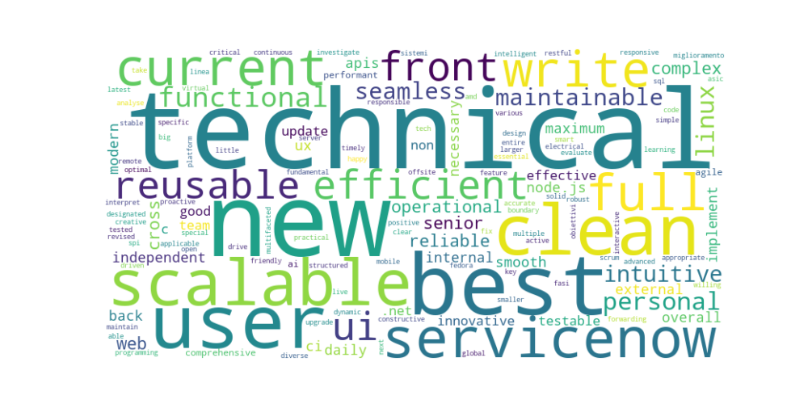

# Job Market Report (YYYY-MM-DD)

## 1. Overview
- Total jobs: …
- Avg salary (EUR): …
- Remote vs Onsite: …
 
## 2. Roles & Levels

桑基图

**Insight:** 用一句话总结发现。

## 3. Locations

## 4. Skills

共现矩阵:

## 5. Responsibilities (Keywords)

### Required Skills

### Desired Skills

共现矩阵:

## 6. Salary

## 7. Education

